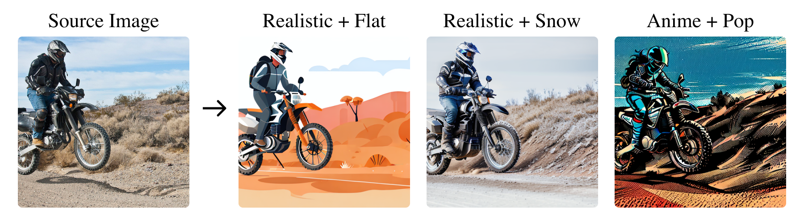
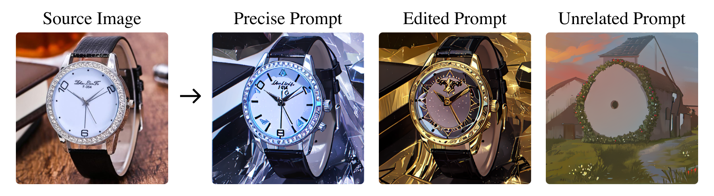
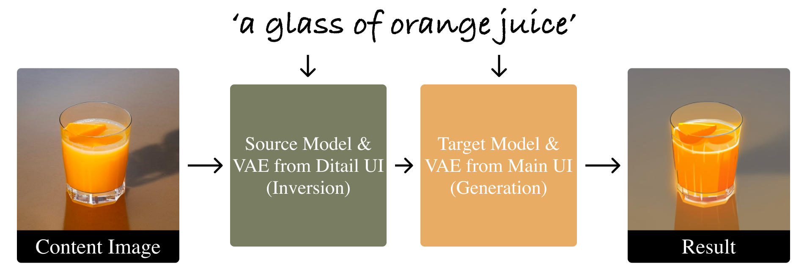

# sd-webui-ditail
The official implementation of the 'Diffusion Cocktail' (Ditail) extension for Automatic 1111 Webui.

Ditail offers a training-free method for novel image generations and fine-grained manipulations of content/style, enabling flexible integrations of existing pre-trained Diffusion models and LoRAs.

Two use cases of Ditail are as follows:

**(a) Stylizing Real/Generated Images (SD Checkpoint + Optional LoRA)**
<p align="center">
  
</p>

**(b) Prompt-based Image Manipulation**
<p align="center">
  
</p>

## Quick Links
 - [Project Page](https://MAPS-research.github.io/Ditail)
 - [Paper Preprint](https://arxiv.org/abs/2312.08873)
 - [HuggingFace Demo](https://huggingface.co/spaces/MAPS-research/Diffusion-Cocktail)
  - [Diffusers Implementation](https://github.com/MAPS-research/Ditail)

## Install

(from Mikubill/sd-webui-controlnet)

1. Open "Extensions" tab.
2. Open "Install from URL" tab in the tab.
3. Enter `https://github.com/MAPS-research/sd-webui-ditail.git` to "URL for extension's git repository".
4. Press "Install" button.
5. Wait 5 seconds, and you will see the message "Installed into stable-diffusion-webui\extensions\adetailer. Use Installed tab to restart".
6. Go to "Installed" tab, click "Check for updates", and then click "Apply and restart UI". (The next time you can also use this method to update extensions.)
7. Completely restart A1111 webui including your terminal. (If you do not know what is a "terminal", you can reboot your computer: turn your computer off and turn it on again.)

## Hyperparameters Explanation
**Illustration for Ditail Pipeline**
<p align="center">
  
</p>

In this example, the image is transformed from a photorealistic style to an anime style. Both the inversion prompt and generation prompt are set to ‘a glass of orange juice.’ You can optionally use different prompts for inversion and generation. For more details, refer to ‘Positive Inversion Prompt’ and ‘Negative Inversion Prompt’ below.

**Basic Options:**
| Name | Description | Default Value |
|:----|:-----------|:-------------:|
| Content Image | The image to be manipulated. Ditail will keep the content and structure of this image while changing the style. | An image of cocktail we took |
| Source Checkpoint | The checkpoint for DDIM inversion. The checkpoint that matches the content image's style is recommended.| `None` = the same checkpoint as that in main ui |
| Source VAE | The VAE checkpoint for DDIM inversion. The checkpoint that matches the source checkpoint is recommended. | `None` = 'Automatic' |
| Positive Prompt Scaling (Alpha) | The scaling factor for the positive prompt. The larger the value, more content and structure of the content image will be preserved. Value between 3-7 is a good starting point. | 5.0 |
| Negative Prompt Scaling (Beta) | The scaling factor for the negative prompt. The larger the value, more content and structure of the content image will be preserved. However, beta being too large might lead to weird colors. | 0.5 |

**Extra Options:**
| Name | Description | Default Value |
|:----|:-----------|:-------------:|
| Positive Inversion Prompt | The positive prompt for DDIM inversion.| `None` = Prompt for generation from main UI |
| Negative Inversion Prompt | The negative prompt for DDIM inversion.| `None` = Negative prompt for generation from main UI |
| Convolutional Ratio | Controls the ratio of steps where we inject the features from the content image to convolutional layers. | 0.8 |
| Attention Ratio | Controls the ratio of steps where we inject the features from the content image to attention layers. | 0.5 |

**Notes:**
- Ditail plugin works in both txt2img and img2img modes. However, we haven't tested inpainting yet.
- When Ditial plugin is enabled, the 'Sampling method' and 'Schedule type' in the main ui will be disabled and set to 'DDIM' and 'Automatic' respectively.
- The source image will be automatically resized and center cropped to the be same as the input 'width' and 'height' in the main ui.
- DDIM inversion steps will be the same as the 'Sampling steps' in the main ui. 
- 'Source checkpoint' should has the same structure as the 'Stable Diffusion checkpoint' in the main ui. **We only support SD1.5 checkpoints for now.** Please stay tuned for the updates.
- To use LoRA, simply add them in the main ui prompt as you would normally do. 


## TODO:
- [ ] SDXL support
- [ ] Support for batch count and batch size larger than 1
- [ ] We are also working on developing extension for comfyui. Stay tuned!

## Acknowledgement
This work is supported in part by the Shanghai Frontiers Science Center of Artificial Intelligence and Deep Learning at NYU Shanghai, NYU Shanghai Boost Fund, and NYU HPC resources and services.

## Citation
If you find our work helpful, please consider cite it as follows:
```bibtex
@article{liu2023ditail,
  title={Diffusion Cocktail: Mixing Domain-Specific Diffusion Models for Diversified Image Generations},
  author={Liu, Haoming and Guo, Yuanhe and Wang, Shengjie and Wen, Hongyi},
  journal={arXiv preprint arXiv:2312.08873},
  year={2023}
}
```